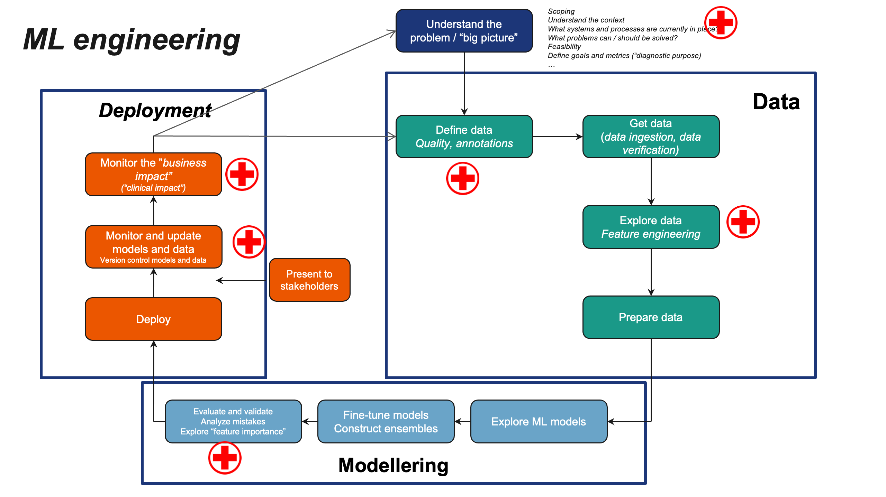
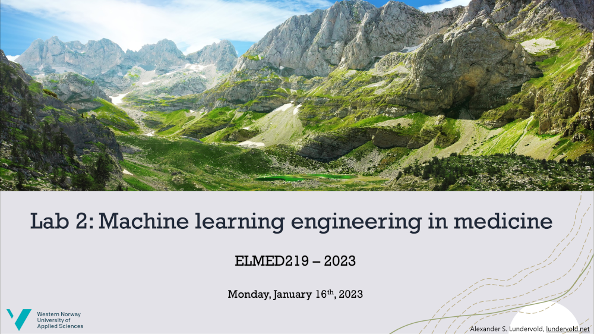

# Lab 2: Machine Learning Engineering in Medicine

<centering>

</centering>

&nbsp;

In this lab, we'll discuss **machine learning engineering**, some of the steps needed to construct machine learning-based applications, and how domain knowledge from medicine is at the heart of the process. 

## Slides

## Jupyter notebooks

| Notebook    |      1-Click Notebook      |
|:----------|------|
|  [ELMED219-Lab2-1.0-Hospital_Length_of_Stay.ipynb](https://nbviewer.org/github/MMIV-ML/ELMED219/blob/main/Lab2-MedML/ELMED219-Lab2-1.0-Hospital_Length_of_Stay.ipynb)   steps through the process of making a simple (and simplified) proof-of-concept application for predicting hospital length of stay.  |  | 

